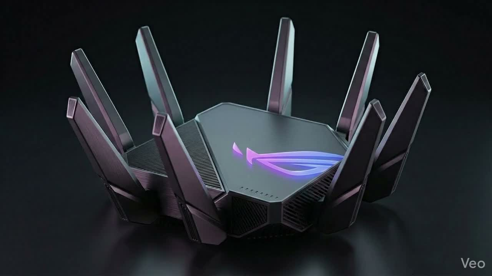

# Vasudev Technologies — WiFi Router Battery Backup System

> 🚀 A hyper-premium cinematic scroll-driven product landing page built with **Next.js 16**, featuring a 240-frame canvas animation sequence.



---

## ✨ Features

- 🎬 **240-Frame Cinematic Scroll Animation** — Canvas-driven product reveal
- ⚡ **Double-Lerp Smooth Scroll** — Zero-lag buttery animation engine
- 📱 **Apple-Style Spec Callouts** — Component labels with glowing anchor dots
- 📊 **Live IoT Dashboard** — Real-time battery, WiFi & power monitoring
- 🎮 **ASUS ROG × Apple Aesthetic** — Dark cyberpunk premium design
- 🖱️ **Custom Cursor** — Magnetic ring with hover effects
- 🚀 **Vercel Ready** — One-click deploy

---

## 🛠️ Tech Stack

| Layer | Technology |
|---|---|
| Framework | Next.js 16 (App Router) |
| Language | JavaScript |
| Styling | CSS Modules |
| Animation | Canvas API + rAF |
| Fonts | Inter (Google Fonts) |
| Deploy | Vercel |

---

## 🚀 Getting Started

```bash
# Install dependencies
npm install

# Run development server
npm run dev
```

Open [http://localhost:3000](http://localhost:3000)

---

## 📁 Project Structure

```
vasudev-wifi/
├── app/
│   ├── layout.js          # Root layout + SEO metadata
│   ├── page.js            # Main cinematic experience
│   ├── page.module.css    # Premium CSS styles
│   └── globals.css        # Global reset + fonts
├── public/
│   └── frames/            # 240 JPEG animation frames
│       ├── ezgif-frame-001.jpg
│       └── ... (240 frames)
├── next.config.mjs        # Next.js config
├── vercel.json            # Vercel deployment config
└── .gitignore
```

---

## 🌐 Deploy to Vercel

[](https://vercel.com/new)

```bash
# Install Vercel CLI
npm i -g vercel

# Deploy
vercel
```

---

## 🎨 Design System

| Token | Value |
|---|---|
| Background | `#050505` |
| Purple Accent | `#7A00FF` |
| Blue Accent | `#00D6FF` |
| Font | Inter 100–900 |

---

## 📦 Product Specifications

| Spec | Value |
|---|---|
| Battery Capacity | 10,000mAh |
| Boost Output | 12V |
| Smart Core | ESP32 (240MHz) |
| Charging IC | TP4056 (1A) |
| Boost Converter | XL6009 (4–38V) |
| Backup Time | 8h+ |

---

**© 2025 Vasudev Technologies. All rights reserved.**
